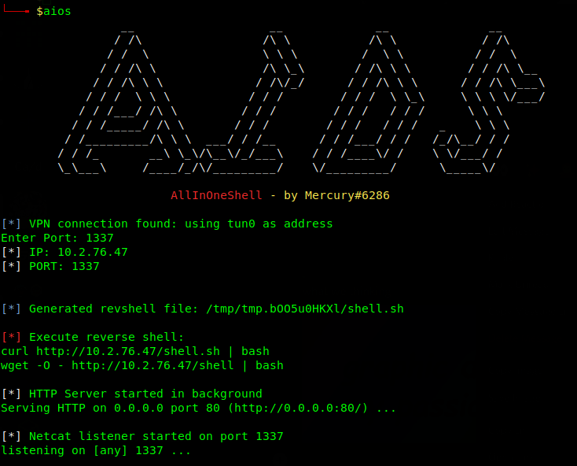

# AllInOneShell
by Mercury180#6286



### Creation

I was faced with a couple of problems that made me decide to make this tool:
* Copying and pasting reverse shells directly into URLs, would often break, so I would inevitably have to transfer a reverse shell from my machine remotely, then execute it with bash.
* Often, machines will not have useful programs such as `python`, which means the reverse shell will be useless.
* Running sudo for ports under 1000 gets *real* annoying.

### Features

AllInOneShell essentially tries to fix the above problems.
What it does: 
- Adds network admin capabilities to python3/netcat, so no sudo is needed.
- Creates a bash script that systematically tries multiple programs to see if installed, and if so, connects back with a reverse shell.
- Writes the bash script to a unique temporary directory, and starts a backgrounded HTTP server there.
- Prints how to call the bash script from your local machine using `curl` or `wget`
- Starts a netcat listener to catch any reverse shells.
- The HTTP server will timeout after 5 minutes, as the process is detached.
- Added potential for command line parameters, so can be run in batch mode if needed:
`aios [IP] [PORT] [MODE]`

UPDATE:
- I've now incorporated a quick script I was using for generating a socat encrypted reverse shell into AIOS.
- You are now presented with the option for either the more reliable (multiple programs checked) netcat listener/file, or the encrypted socat listener/file.
- Unfortunately I couldn't include the socat reverse shell into the general bash revshell file, as it uses a different type of listener.

### Config

The default port for the HTTP server is `80` (to try and bypass some basic firewall restrictions), but this can be changed easily at the top of the script in "# Config Items".
Be aware, the HTTP process detaches and once the reverse shell comes through, it can be a pain to kill. There is a timeout for 5 minutes on the process, but that can be extended in the config again.


### Notes

> The `nc.traditional` binary struggles to keep TCP sockets open, so I've built in a quick function to detect if it is being used by `nc`, and if so upgrades it to `ncat`, which is generally better (also supports IPv6), and more secure (isn't compiled using the GAPING_SECURITY_FLAW flag).

> Additionally, the reverse shells are currently only for Linux, but I'm definitely working on expanding this to work for Windows/Powershell.

> This program is made specifically for HTB/THM, and should definitely not be used for anything other than boot2root machines. It is quite clunky, but it gives the advantage of convenience, as it tries to incorporate everything you need in a bash script. 
Additionally, the tmp directories are not deleted, but will be on machine restart. 
`rm -r /tmp/tmp-*`, to do this manually.

> ```sh
ln -sf [path to aios.sh] /usr/bin/aios
```

> Then to call the reverse shell tool, simply run `aios`.

> This tool only covers a few of the programs that can be used for reverse shells.
To see more, visit https://www.revshells.com/, by the notorious 0day.
